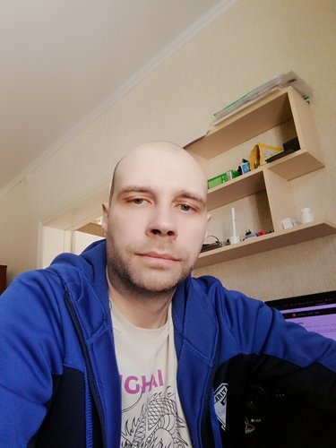

# Pavel Shiryaev



## Contacts:

- **rs school discord name:** Pavel SkyHobbit (@SkyHobbit36)
- **E-mail:** skyhobbit@yandex.ru
- [t.me](https://t.me/Sky_Hobbit)

## About me:

I'am junior frontend developer. 10 years of experience as a web designer. Since 2020, I started learning JavaScript and continue to this day.

## Skills:

- HTML, CSS
- JavaSctipt
- Git, GitHub
- Gulp, Webpack
- React, Redux, axios, react-router-dom

## Work experience:

- 2009 Flash animator
- 2009-2013 Graphic designer, website design
- 2013-present Pogramming in Action Script 3, graphic designer, website design, create sites on worpress

## Achievements:

The largest project is the development of a single page application "Photo book and souvenir Editor" for the website [foto-sivma.ru](https://foto-sivma.ru/front/photobook/konfigurator.html)  
JavaScript, jQuery, Gulp technologies are applied.  
Implemented the entire frontend, including the design. Also, the duties included the preparation of technical tasks, negotiations with the customer.

## Code examples:

```
function tribonacci(signature,n){
  if (n == 0) return []
  if(n <= 3){
    signature.length = n
    return signature
  }

  while (n > 3){
    let l = signature.length
    signature.push(signature[l-1] + signature[l-2] + signature[l-3])
    n--
  }
  return signature
}
```

## English:

A1-A2
